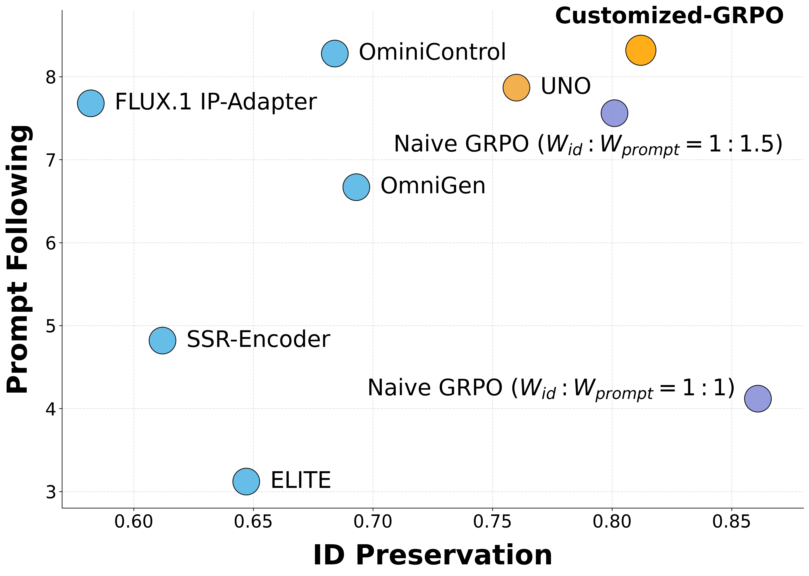

# Customized-GRPO: Reinforcement Learning for Subject-Driven Image Generation

This repository provides the official implementation of **Customized-GRPO**, an online reinforcement learning framework for subject-driven text-to-image generation

## Introduction

Subject-driven image generation aims to create novel images that both preserve the detailed identity of provided reference images _and_ follow a complex textual prompt. However, existing methods struggle to balance the trade-off between **identity preservation (fidelity)** and **prompt adherence (editability)**.

Customized-GRPO is the first to leverage online reinforcement learning (specifically GRPO) at the policy level to resolve this issue. It introduces two key innovations:

- **Synergy-Aware Reward Shaping (SARS):** A Pareto-inspired, non-linear mechanism that penalizes conflicted reward signals and amplifies synergistic ones, providing sharper gradients for learning.
- **Time-Aware Dynamic Weighting (TDW):** A curriculum-style schedule that dynamically adjusts optimization pressure according to the temporal dynamics of the diffusion process.

Extensive experiments on DreamBench demonstrate significant improvements over naive GRPO baselines and state-of-the-art competitors, achieving a superior balance between identity preservation and prompt following.
---
## Installation
Recommended: Python 3.10+; CUDA-enabled GPU(s).
```bash
conda create -n customized python=3.10
conda activate customized
pip install -r requirements.txt
```
---
## Dataset Preparation
Recommended: Python 3.10+; CUDA-enabled GPU(s).
```bash
conda create -n customized python=3.10
conda activate customized
pip install -r requirements.txt
```
---
## Training
Training in Customized-GRPO can be flexibly configured to use different reward models for optimizing the policy. By default, we adopt DINO-v2 for identity preservation and HPS-V3 for prompt adherence, which together provide strong alignment with human preferences
- Train with DINO-v2 and HPS-V3 as reward models (recommended):
```bash
bash scripts/train_customized_grpo.sh
```
- Train with a Vision-Language Model (VLM) as the reward model (e.g., Gemini-2.5-Pro, Qwen-VL-Max, GPT-4o):
```bash
bash scripts/train_grpo_vlm.sh
```
All training scripts are optimized on 8 GPUs by default. You can adjust the GPU number, batch size, reward functions, and other training parameters in the corresponding config files located in config/train/*.yaml
---
## Results

### Additional Cases


