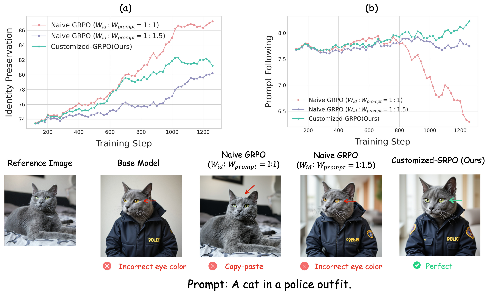
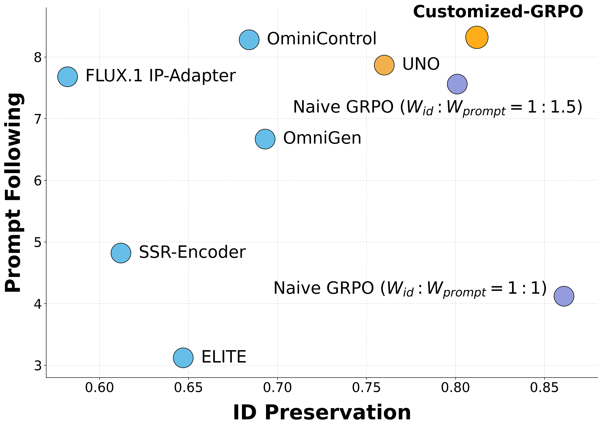

<p align="center">
  <strong>From Competition to Synergy: Unlocking Reinforcement Learning for Subject-Driven Image Generation</strong>
  <br>
  <em>Ziwei Huang, Ying Shu, Hao Fang, Quanyu Long, Wenya Wang, Qiushi Guo, Tiezheng Ge, Leilei Gan</em>
  <br>
  Zhejiang University | Alibaba Group | Nanyang Technological University
</p>

<div align="center">

[](https://2026.aclweb.org/)
[](https://arxiv.org/abs/2510.18263)
[](https://opensource.org/licenses/MIT)

</div>

## 🔥 News
- **[2026.04]** 🎉 Our paper has been accepted to **ACL 2026 Main Conference**!
- **[2025.10]** 🚀 We officially release the code, pre-trained weights, and evaluation scripts for Customized-GRPO.

---


## 📖 Introduction

Subject-driven image generation aims to create novel images that both preserve the detailed identity of provided reference images _and_ follow a complex textual prompt. However, existing methods struggle to balance the trade-off between **identity preservation (fidelity)** and **prompt following (editability)**.

Customized-GRPO is the first to leverage online reinforcement learning (specifically GRPO) at the policy level to resolve this issue. It introduces two key innovations.

<div align="center">
  
  <br>
  <em>Figure: Customized-GRPO achieves a state-of-the-art balance between ID Preservation and Prompt Following on DreamBench.</em>
</div>

---

## 🚀 Key Innovations

- **Synergy-Aware Reward Shaping (SARS):** A Pareto-inspired, non-linear mechanism that penalizes conflicted reward signals and amplifies synergistic ones, providing sharper gradients for learning.
- **Time-Aware Dynamic Weighting (TDW):** A curriculum-style schedule that dynamically adjusts optimization pressure according to the temporal dynamics of the diffusion process.

Extensive experiments on DreamBench demonstrate significant improvements over naive GRPO baselines and state-of-the-art competitors, achieving a superior balance between identity preservation and prompt following.

## 🛠️ Getting Started
Recommended: Python 3.10+; CUDA-enabled GPU(s).
```bash
conda create -n customized python=3.10
conda activate customized
pip install -r requirements.txt
```
---
### Dataset Preparation
Training datasets:
Download and preprocess the [Syncd](https://github.com/nupurkmr9/syncd) dataset.

Evaluation datasets:
Please refer to [DreamBench](https://github.com/google/dreambooth) for benchmark images and prompts.

---
### Customized-GRPO Training
Training in Customized-GRPO can be flexibly configured to use different reward models for optimizing the policy. By default, we adopt DINO-v2 for identity preservation and HPS-V3 for prompt adherence, which together provide strong alignment with human preferences
- Train with DINO-v2 and HPS-V3 as reward models (recommended):
```bash
bash ./scripts/train_customized_grpo.sh
```
- Train with a Vision-Language Model (VLM) as the reward model (e.g., Gemini-2.5-Pro, Qwen-VL-Max, GPT-4o):
```bash
bash ./scripts/train_grpo_vlm.sh
```

All training scripts are optimized on 8 GPUs by default. You can adjust the GPU number, batch size, reward functions, and other training parameters in the corresponding config files located in config/train/*.yaml

---

### Inference
To generate images using the trained models:
```bash
bash ./scripts/eval_dreambench.sh
```

## 📊 Results



## 💖 Acknowledgements
This project is built upon the foundational work of [UNO](https://github.com/bytedance/UNO), [Flow-GRPO](https://github.com/yifan123/flow_grpo) and [Dance-GRPO](https://github.com/XueZeyue/DanceGRPO) in subject-driven generation. We sincerely thank the developers of these open-source resources.

## 🤝 Citation
If you find our code, weights, or paper useful, please cite our work:
```Bibtex
@article{huang2025competition,
  title={From Competition to Synergy: Unlocking Reinforcement Learning for Subject-Driven Image Generation},
  author={Huang, Ziwei and Shu, Ying and Fang, Hao and Long, Quanyu and Wang, Wenya and Guo, Qiushi and Ge, Tiezheng and Gan, Leilei},
  journal={arXiv preprint arXiv:2510.18263},
  year={2025}
}
```

## 📅 TODO & Release Schedule
- [x] Release the code for training and evaluation.
- [x] Release the training datasets.
- [ ] Release the checkpoints
- [x] Release the paper of Customized-GRPO on arXiv.


